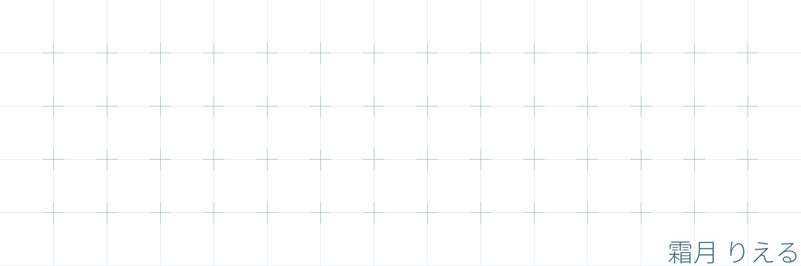

](https://github.com/rierun/)

# りえるん

- 霜月 りえるん(he/they)です! / I'm Rierun Shimotsuki(he/they)!
- 富山県に住んでいます! / I live in Toyama, Japan!
- 主にTypeScriptやKotlin、最近はRustでプログラムを書いています! / I mainly write programs in TypeScript, Kotlin, and recently Rust!
- 主にフロントエンドらへんを開発しています! / I mainly develop front-end stuff!
- ぜひ仲良くしてください! / Let's be friends!

## スキルとか

## すてーたす!

 
  